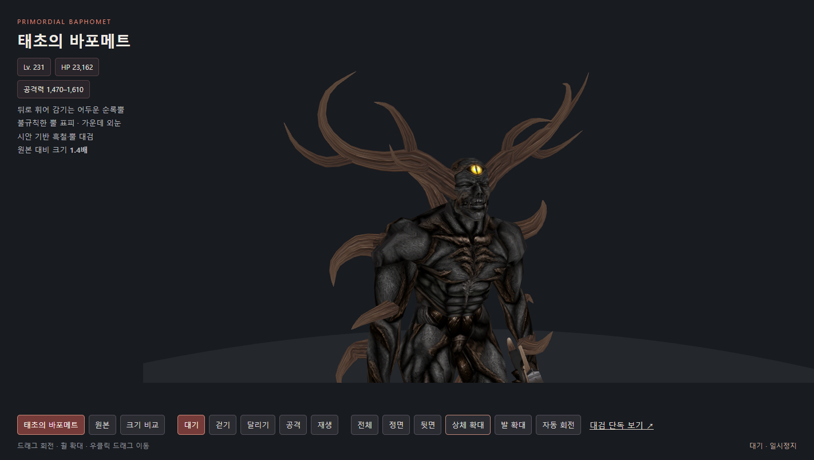
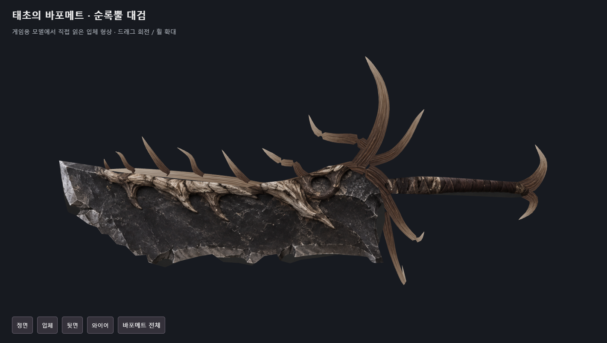
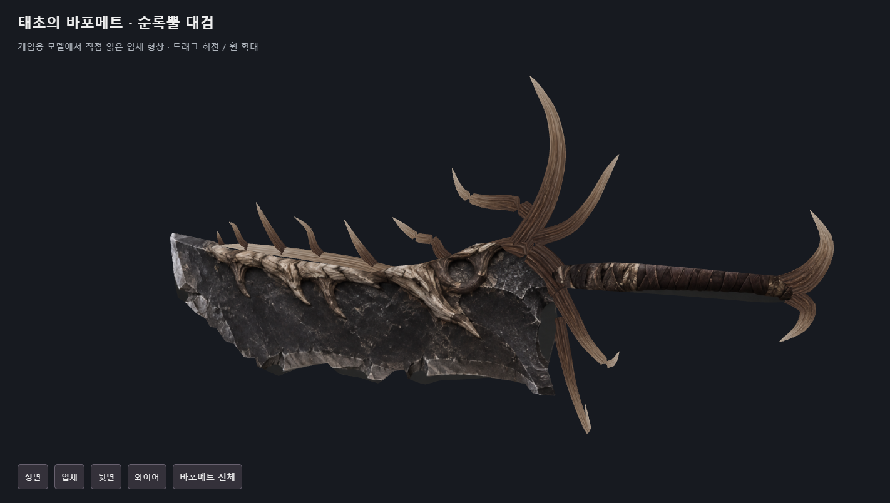
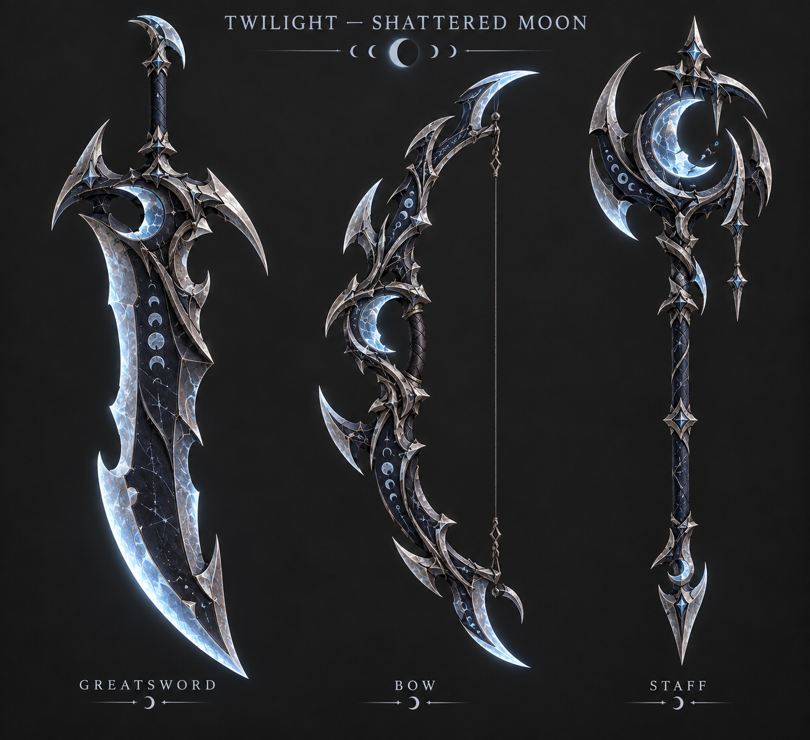

# 바포메트 외눈·곡선 뿔·대검 / 트와일라잇 달 시안

후속 작업에서 트와일라잇 시안을 실제 무기로 적용했다. 최신 무기·메테오·얼음 상태는 [CATACLYSM-MOON-REVIEW.md](CATACLYSM-MOON-REVIEW.md)를 따른다.

이번 변경은 로컬 저장소와 검토용 미리보기에 반영했다. 기존 아버지용 설치 폴더, outputs 실행 CMD, 계정·DB에는 적용하지 않았다. 원격 저장소에도 전송하지 않았다.

- [바포메트 전체·동작 미리보기](http://127.0.0.1:8876/assets/primordial-baphomet/?v=dark-antler-v3c)
- [대검 단독 회전 미리보기](http://127.0.0.1:8876/assets/primordial-baphomet/cleaver.html?v=dark-antler-v3c)
- [메테오 등 스킬 미리보기](http://127.0.0.1:8878/)

## 바포메트

양쪽 눈은 감고 가운데 눈만 크고 밝은 금색으로 열었다. 몸은 어두운 회흑색이며 머리 뿔은 어두운 각질로 변경했다. 원래 양뿔과 정수리 뿔은 제거된 상태다.

양옆의 큰 뿔은 뒤로 휘었다가 위·앞으로 돌아오는 곡선으로 만들었다. 좌우 가지 수와 길이를 다르게 했으며, 몸 돌기는 13개를 어깨·팔·다리·등에 서로 다른 높이·방향·크기로 배치했다. 15개 뿌리를 같은 뼈에 연결된 실제 피부 삼각형에 맞추고 밑부분을 피부 안으로 넣었다. 세 개씩 정렬되던 배치를 없앴다.

## 실제 대검 모델

이전 붉은 칼을 완전히 교체했다. 앞서 만든 baphomet-antler-cleaver-concept.png의 넓고 패인 날, 각질 등뼈, 비대칭 가지 가드, 가죽 손잡이, 갈라진 끝 장식을 실제 네이티브 메시로 재구성했다. 날에는 두께와 경사면이 있고 뿔은 입체 곡면이다. 원래 손잡이 뼈 14와 모델 행렬을 유지한다.

시안의 표면을 날에 투영하고 입체 뿔에는 별도로 ImageGen에서 만든 각질 재질을 사용했다. 시안의 조명과 사진 같은 깊이 표현이 게임 렌더러에서 그대로 재현되는 것은 아니다. 단독 미리보기의 입체·뒷면 버튼에서 실제 결과를 확인할 수 있다.

## 트와일라잇 새 시안

기존 블랙나이트 검·창과 게임 내 장식형 활의 실제 모델을 참고했다. 파란 표면색 위주의 인상을 줄이고, 초승달과 달의 위상 문양, 깨진 달 조각, 비대칭 곡선과 빈 공간이 무기의 외곽선에서도 보이도록 했다. 검·활·지팡이 세 종류이며 현재는 ImageGen 컨셉 이미지다. 실제 트와일라잇 무기 모델은 이번에 교체하지 않았다.

생성에 사용한 세 프롬프트 원문은 [imagegen-v3-prompts.json](imagegen-v3-prompts.json)에 있다. 기존 대검 시안의 프롬프트는 [IMAGEGEN-PROMPTS.md](IMAGEGEN-PROMPTS.md)에 있다.

## 검증

- 네이티브 MOD 재파싱 결과와 브라우저 모델 데이터 동일.
- 원래 몸 809개 정점 위치·뼈 연결, 29개 뼈와 기존 애니메이션 파일 유지.
- 총 5,861개 공유 정점 / 11,416개 삼각형 / 원래 2개 메시. UV와 면 법선을 유지하면서 중복 위치만 공유하여 스키닝 계산량을 줄였다.
- 새 대검의 열린 경계 0, 퇴화 삼각형 0, 새 면의 법선 방향 정상.
- 두 WTM 텍스처를 다시 해독해 미리보기 PNG 픽셀과 일치 확인.
- 정면·입체·뒷면 및 바포메트 동작 미리보기 확인. 브라우저 콘솔 오류 없음.
- 실제 Direct3D 게임 안의 전투·성능 검수는 남아 있다.

검증 원문: ../primordial-baphomet/sculpt-validation.json, ../primordial-baphomet/v3-native-validation.json.
재생성: runtime/python/python.exe -B -X utf8 tools/sculpt_primordial_baphomet.py.
배포 매니페스트만 2026-09-23-dark-antler-moon-preview로 갱신했다. 이번 버전은 기존 설치본에 배포하지 않았다.
