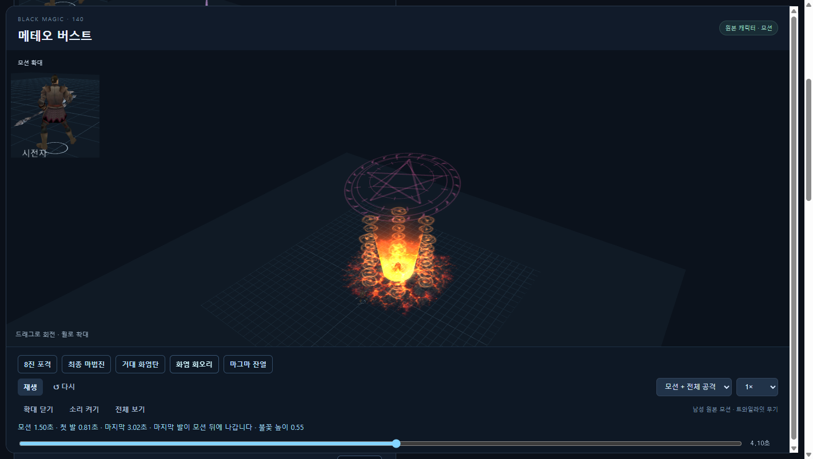
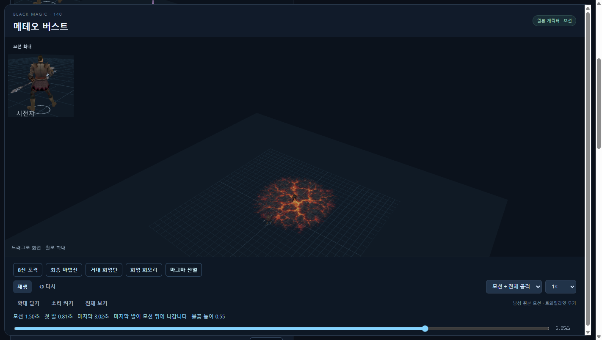
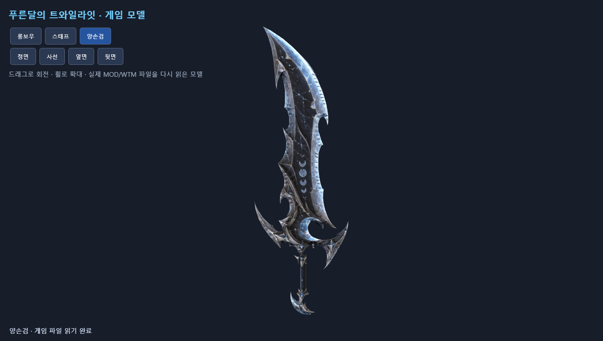
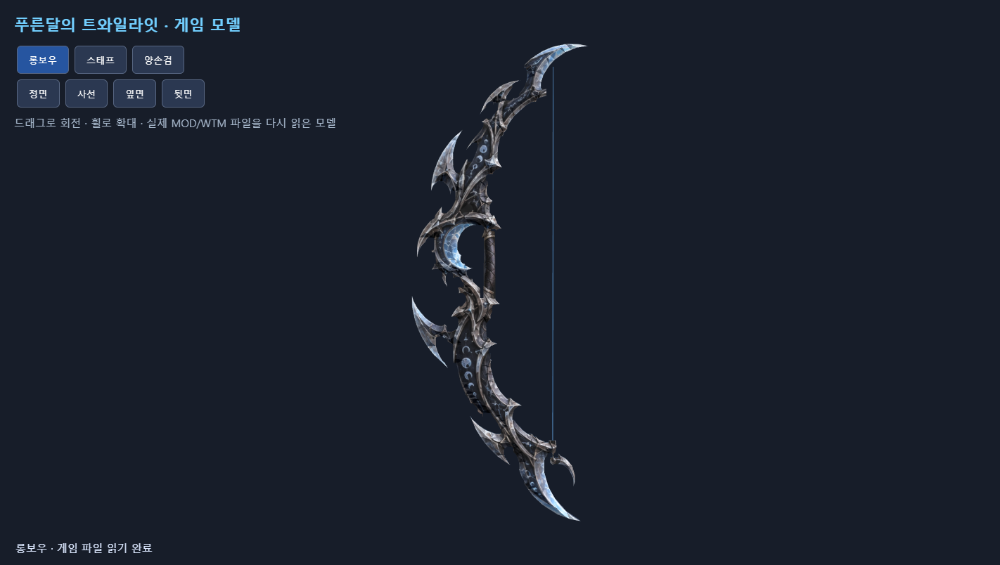
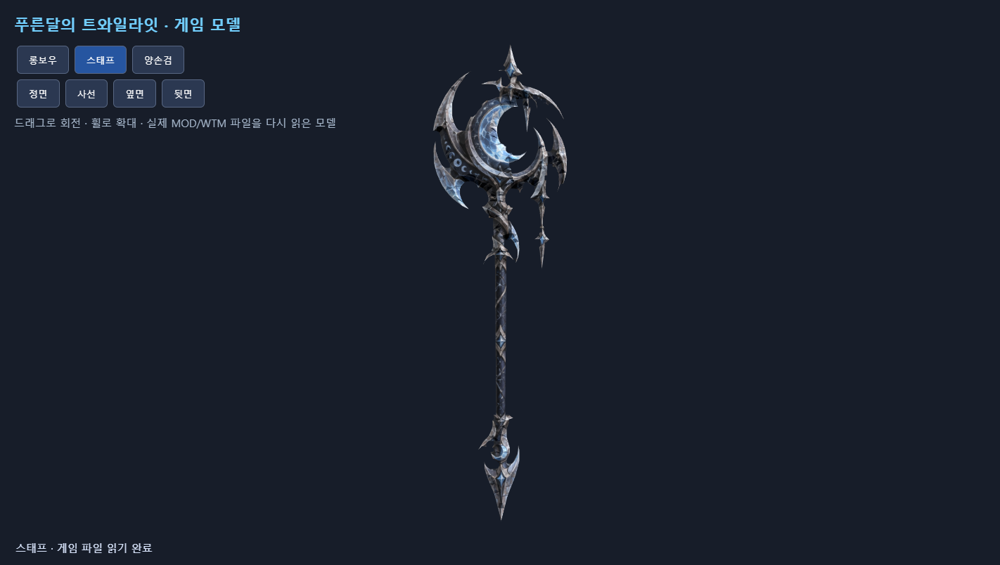

# 8진 메테오 · 지속 유입 코시투스 · 달 무기 재적용

- [스킬 미리보기](http://127.0.0.1:8878/): 장면별 버튼과 확대 보기를 추가했다. 현재 저장된 색상·조절값은 유지했다.
- [적용한 달 무기 3종](http://127.0.0.1:8876/assets/twilight-set/?v=shattered-v3): 실제 MOD/WTM을 다시 읽은 회전 미리보기.

## 메테오

서로 다른 상공 위치·높이·기울기의 마법진 8개가 생긴다. 각각 원형 룬·별·삼각 문양의 3겹이며 총 24장이다. 기존 상위 파이어볼의 실제 메시·불꽃 텍스처·회전을 확대해 각 마법진에서 서로 다른 지점으로 발사한다.

작은 포격이 끝난 뒤에만 최종 대형 마법진 3겹이 등장한다. 그다음 더 큰 불덩어리가 내려오며, 실제 도착 순간에 폭발과 충격파, 주변으로 퍼지는 화염 회오리 6개, 마그마 바닥 잔열이 이어진다. 회오리는 원래 토네이도의 windstrike.WEM을 사용한다. 후속 효과는 별도 고정 시각 대신 같은 비행 경로의 도착 단계에 연결했다.

저장된 설정의 미리보기 기준: 첫 포격 0.81초, 최종 마법진 2.37초, 거대 탄 발사 3.02초, 도착 약 3.45초, 잔열 소멸 약 7.25초. 30Hz 미리보기의 비행시간 추정이며 실제 게임 프레임 처리와 차이가 있을 수 있다. 작은 탄 8개와 마지막 큰 탄을 표시하지만 기존 피해 이벤트 7개와 서버 범위 6은 유지한다.

마그마는 내장 ImageGen으로 생성한 [meteor-magma-imagegen.png](meteor-magma-imagegen.png)를 네이티브 가산 합성용 바닥 텍스처로 변환했다. [생성 프롬프트 원문](magma-imagegen-prompt.json), 변환 도구 tools/build_magma_decal.py.

## 아일랜드 오브 코시투스

84개 얼음 조각이 바깥에서 안으로 실제 이동하며, 중앙 기둥이 나온 뒤에도 종료 직전까지 새 조각이 계속 유입된다. 기존처럼 외곽의 세 묶음만 나타나고 멈추는 방식이 아니다. 하단·중단·상단에 높이가 다른 마법진 3개가 있고, 큰 중앙 기둥과 바깥으로 뻗는 굵은 얼음 가시 12개는 끝까지 유지된다. 피해 이벤트 3개와 범위는 유지했다.

## 달 무기 실제 적용

사용자가 고른 twilight-shattered-moon-concept.png의 비대칭 초승달·달의 위상·은색 날을 양손검, 롱보우, 스태프의 입체 메시와 재질에 반영했다. 날의 경사면·측면·둥근 손잡이·활줄을 만들고 원래 무기 부착 방식과 아이템 번호·강화 수치를 유지했다. 세 무기 모두 한 메시와 세 LOD를 사용한다.

양손검 7,724 / 활 5,104 / 스태프 5,988 삼각형. 열린 경계·뒤집힌 이음새·다중 연결 모서리 0개. 실제 네이티브 파일의 면, UV, 재질, 아이템 42개 정의·강화 단계·서버/클라이언트/툴팁 일치 검사 통과. 새 active-design.json에 따라 기존 재빌드 명령도 승인한 달 디자인을 사용한다.

기존 아버지용 설치 경로의 work/laqia-runtime/client/GameClient와 저장소의 runtime/client/GameClient에 무기 파일 12개씩 적용했다. 모델 9개와 텍스처 3개만 교체했다. 실행 CMD·개인 설정·아이템 데이터·실행 파일 등 보호 파일 21개는 전후 해시가 동일하며 서버와 DB는 조작하지 않았다. 백업과 적용 해시는 ../twilight-set/shattered-moon-installation.json에 있다.

## 상태와 검증

무기는 기존 로컬 설치본 적용 완료. 새 스킬 연출은 저장소와 미리보기에 반영했으며 기존 설치본에는 아직 적용하지 않았다. 미리보기는 적용 API가 차단된 preview-only 모드다. 원격 저장소로 전송하지 않았다. 실제 Direct3D 전투·성능 육안 검수는 남아 있다.

검증: 20개 조절 항목과 최솟값/최댓값, 스킬별 피해 이벤트 수, 원래 소리·모션, 도착 연동 후속 효과, 얼음의 지속 유입, 네이티브 파서, 실제 텍스처 10,317,824개 픽셀의 미리보기 일치 검사 통과. 기존 무기 표·강화 수치와 설치 경로 보존 검사 통과.

재생성 도구: tools/build_shattered_moon.py, tools/build_magma_decal.py, client-overlay/Tools/SkillColors/meteor_storm.py, cocytus.py, native_vfx.py. 스킬은 공통 tuning.compile_resources가 미리보기와 게임 파일을 함께 만든다.
