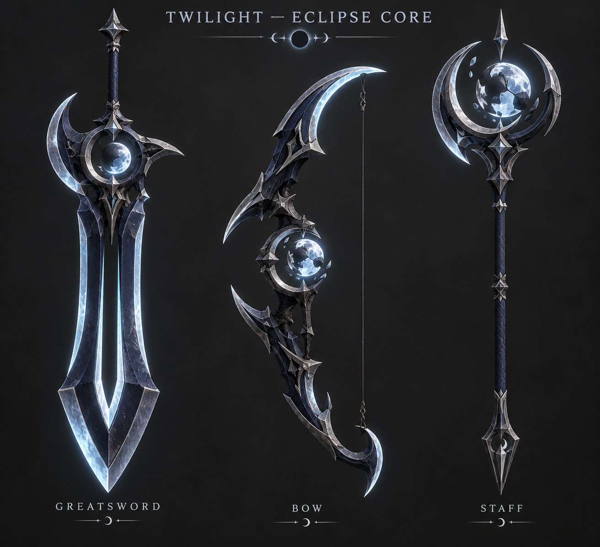
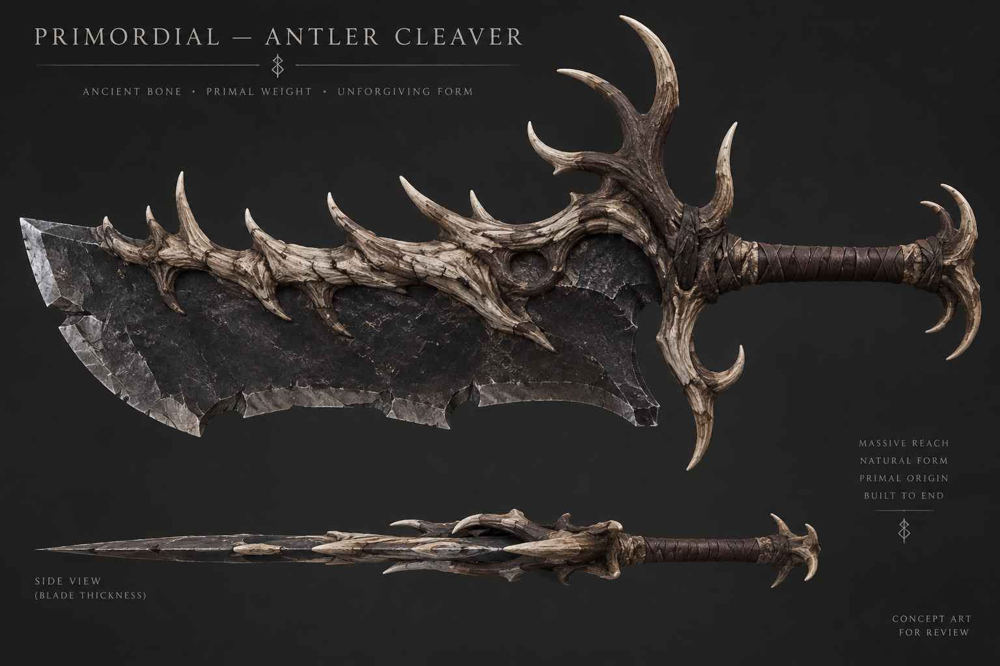
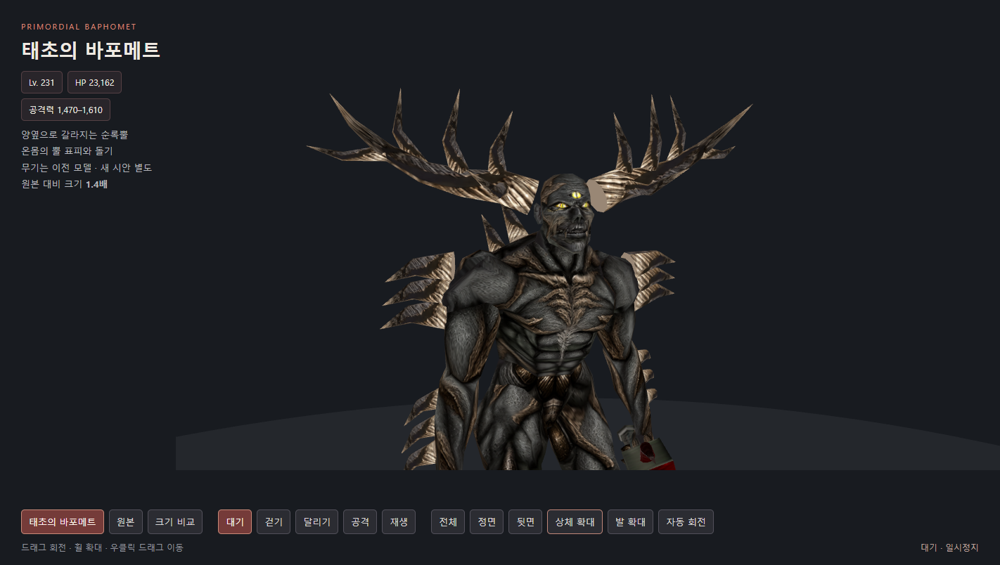

# 순록뿔 바포메트와 메테오 시안

후속 바포메트·검·트와일라잇 수정은 [BAPHOMET-V3-REVIEW.md](BAPHOMET-V3-REVIEW.md)를 따른다. 아래의 바포메트 외형과 검 미적용 설명은 이전 시점의 기록이다.

이번 수정은 검토용이다. 아버지용 설치본에는 적용하지 않았고, 실행 CMD·계정·서버·DB도 변경하지 않았다. 앞선 REVIEW.md의 배포 결과는 이전 버전에 대한 기록이다.

- [스킬 미리보기](http://127.0.0.1:8878/): 메테오, 코시투스, 아처 2종. 재생/일시정지, 시간 막대, 0.5×/0.25×, 소리, 회전·확대 및 조절값을 사용할 수 있다. 이번 창은 미리보기 전용으로 게임 적용 기능이 차단되어 있다.
- [바포메트 모델](http://127.0.0.1:8876/assets/primordial-baphomet/?v=antler-20260923): 원래 양뿔과 새 정수리뿔을 제거하고 양옆으로 갈라지는 순록뿔로 변경. 피 얼룩·가슴 구멍·흐르는 피 조형은 제거하고 뿔 표피, 어깨·팔·정강이·등 돌기로 변경. 원래 뼈 29개와 모션 유지. 칼은 직전 톱니형 모델이며 아래 무기 시안은 아직 메시로 적용하지 않았다.
- 메테오: 상공에 높이와 반경이 다른 마법진 3겹. 바깥 룬, 별 문양, 삼각 문양이 서로 반대로 회전한다. 큰 운석 7개와 주변 작은 운석 9개가 다른 시작점·시차·적중 위치를 가진다. 마지막 운석은 더 크고, 도착 순간 폭발 → 지면 충격파 → 잔불이 이어진다. 피해 이벤트는 기존 7회, 피해 범위도 기존 6이다. 작은 운석은 연출용이다.

현재 저장된 메테오 분홍색과 코시투스 보라색은 유지했다. 패널에서 색을 변경해 비교할 수 있다. 운석은 기존 엔진의 가산 합성으로 빛나는 각진 본체와 꼬리를 표현하며, 불투명 검은 암석 재질은 아니다. 미리보기는 네이티브 WEM/WED/WTM 자산을 읽으며 실제 게임 전투 캡처는 아니다.

## ImageGen 무기 시안

내장 ImageGen으로 만든 검토용 컨셉이다. 실제 게임에 이미 적용된 무기로 오해하지 않도록 분리했다.

생성 프롬프트는 IMAGEGEN-PROMPTS.md에 보관했다. 몸 표피용 출력은 ../primordial-baphomet/body-antler-imagegen.png이며 네이티브 텍스처 포맷으로 변환했다.
